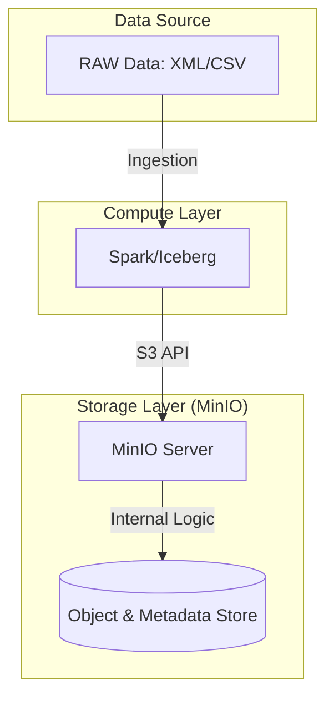
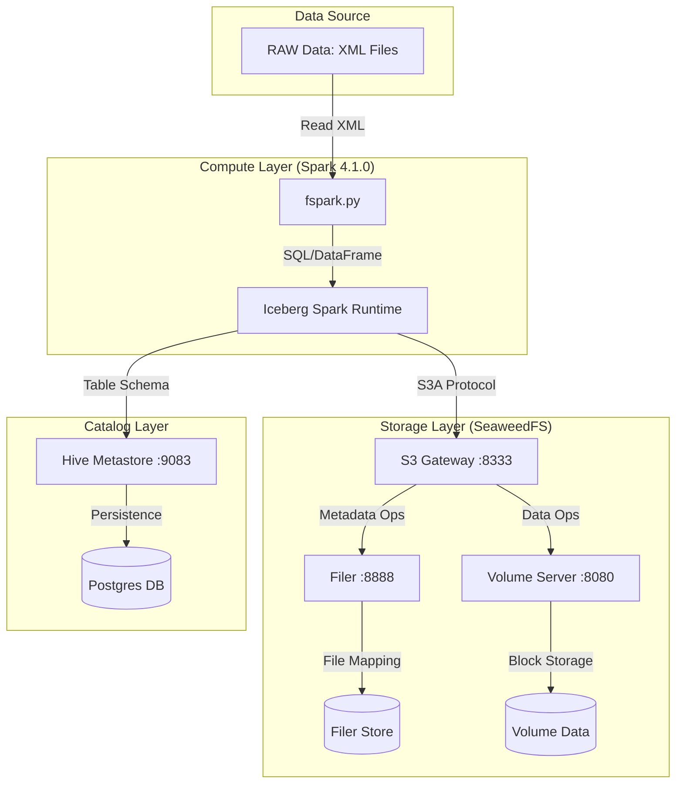

# Feature: Raw Data Storage Migration (MinIO to SeaweedFS/Iceberg)

이 문서는 기존 MinIO 기반 저장 구조에서 SeaweedFS 및 Apache Iceberg 기반의 레이크하우스 구조로 변경된 상세 내용을 기록합니다.

## 1. 아키텍처 비교

### 기존 (MinIO 기반)
*   **구조**: 단일 계층 S3 호환 객체 스토리지.
*   **데이터 관리**: 단순 파일/디렉터리 구조 (Hive-style partitioning).
*   **한계**: 대량의 작은 파일 처리 시 메타데이터 부하, 트랜잭션 보장 어려움.

### 현재 (SeaweedFS + Iceberg 기반)
*   **구조**: 분산형 아키텍처 (Master, Volume, Filer, S3 Gateway).
*   **데이터 관리**: Apache Iceberg 테이블 포맷 (Snapshot 기반 트랜잭션).
*   **특징**: 메타데이터(Filer)와 실제 데이터(Volume)의 분리 저장으로 성능 및 확장성 최적화.

## 2. 데이터 흐름 비교 (Data Flow Comparison)

### 2.1. 기존 MinIO 흐름 (Monolithic)
MinIO는 단일 서버(또는 클러스터)가 메타데이터와 실제 데이터를 모두 관리하는 단순한 구조입니다.

### 2.2. 현재 SeaweedFS 흐름 (Distributed)
SeaweedFS는 메타데이터(Filer)와 실제 데이터(Volume)를 분리하여 처리하며, S3 Gateway가 이를 중계합니다.

## 3. 상세 변경 사항

### 3.1. 저장 경로 및 포맷
*   **Warehouse URI**: `s3a://lakehouse/warehouse/`
*   **테이블 구조**:
    *   **Metadata**: `.../metadata/*.metadata.json`, `*.avro` (스키마, 스냅샷 정보)
    *   **Data**: `.../data/*.parquet` (실제 레코드 데이터, 파티션별 저장)
*   **변경점**: 단순 파일 저장이 아닌, Iceberg 엔진이 관리하는 **트랜잭션 로그 기반** 저장으로 변경됨.

### 3.2. SeaweedFS 내부 동작
1.  **Filer**: S3 API 요청을 받아 파일 시스템 계층 구조를 관리합니다. (버킷 생성 시 `/buckets/lakehouse` 디렉터리 생성)
2.  **Volume**: 실제 데이터 블록을 저장하며, Filer가 제공하는 ID를 통해 데이터를 조회합니다.
3.  **S3 Gateway**: Spark/Iceberg가 사용하는 S3A 프로토콜을 SeaweedFS 내부 명령으로 변환합니다.

### 3.3. 설정 최적화 (Bugfix 반영)
*   **Numeric Overrides**: Spark 4.1.0의 파싱 에러를 방지하기 위해 `60s`, `30s` 등의 문자열 대신 `60000`, `30000` 등 순수 숫자 설정을 사용합니다.
*   **Standard Auth**: `S3_ACCESS_KEY` 대신 표준 `AWS_ACCESS_KEY_ID` 환경 변수를 사용하여 호환성을 높였습니다.

## 4. 주요 이점
1.  **트랜잭션 보장**: Iceberg를 통해 쓰기 작업 중 장애가 발생해도 데이터 일관성이 유지됩니다.
2.  **작은 파일 최적화**: SeaweedFS는 수십억 개의 작은 파일을 효율적으로 관리할 수 있도록 설계되었습니다.
3.  **스키마 진화**: 테이블 컬럼 변경이나 파티션 변경 시 데이터를 재작성하지 않고 메타데이터 수정만으로 처리가 가능합니다.

## 5. 왜 더 복잡한 구조를 사용하는가? (Complexity vs. Scalability)

... (중략) ...

**결론적으로:** MinIO는 설정이 간편하여 소규모~중규모에 유리하지만, 현재 구축 중인 **레이크하우스(Lakehouse)**처럼 데이터가 기하급수적으로 늘어나는 환경에서는 SeaweedFS의 분산 구조가 장기적으로 훨씬 안정적이고 빠른 성능을 제공합니다.

## 6. 향후 확장성 및 고가용성 (Future Scalability & HA)

현재의 분산 구조는 나중에 서비스 규모가 커졌을 때 클러스터링 및 고가용성(HA) 구조로 매우 쉽게 전환할 수 있도록 설계되었습니다.

### 6.1. 컴포넌트별 확장 전략
*   **Master Server**: 현재 1대에서 3대 또는 5대로 늘려 **Raft 합의 알고리즘** 기반의 고가용성 클러스터를 구성할 수 있습니다. (한 대가 죽어도 서비스 유지)
*   **Volume Server**: 저장 용량이 부족하면 새로운 서버를 추가하기만 하면 됩니다. SeaweedFS가 자동으로 데이터를 분산 저장합니다.
*   **Filer**: 상태가 없는(Stateless) 구조이므로 여러 대를 띄우고 로드밸런서(L4/L7)를 앞에 두어 요청을 분산할 수 있습니다.
*   **Data Replication**: 설정 하나만으로 데이터를 여러 서버에 복제(Replication)하여 서버 장애 시에도 데이터 유실을 방지할 수 있습니다.

### 6.2. 이전 용이성
현재 단일 노드(Docker Compose)에서 실행 중인 설정을 거의 그대로 유지하면서, 각 컴포넌트를 별도의 물리 서버나 쿠버네티스(Kubernetes) 환경으로 옮기기만 하면 즉시 엔터프라이즈급 클러스터로 변모합니다. 이는 처음부터 역할을 분리해 두었기 때문에 가능한 장점입니다.
